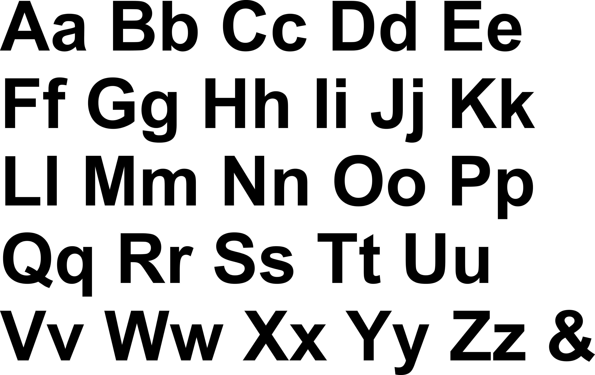
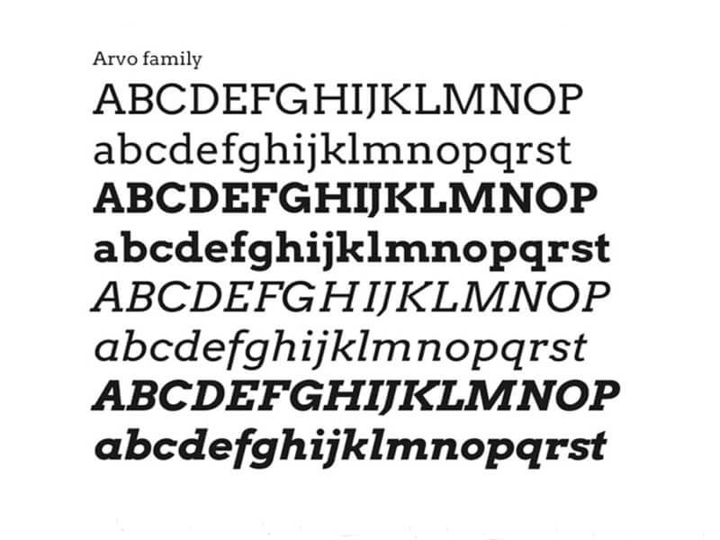
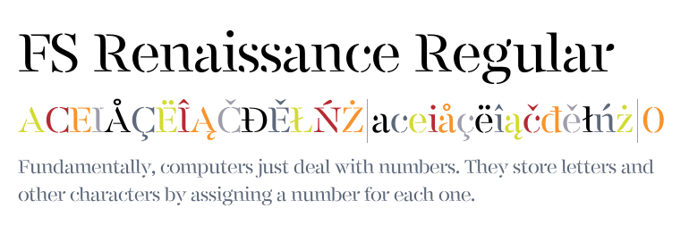

# Stakeholders
## Customers
+ The website needs to have information on the product there selling in the case of a phone shop, the brand, model, camera resolusion
+ The needs to be easly accessible for everyone
+ The website needs to be easy to navigate and easy to find things
+ The Website needs to have an insial rendering of under 2 seconds

## Owners
+ The website needs to look good as this will repersent your brand
+ The website needs to look professional
+ The website needs to bring in business and money
+ The programmers need to be cheap because the owners dont want to pay more the they need

## Developers 
+ Well Documented
+ Easy maintainable
+ Easy to test 
+ Meets the owners standards

## Paletton 

#### Paletton template link: https://paletton.com/#uid=5490u0kllllaFw0g0qFqFg0w0aF

*** Primary color:

   + .color-primary-0 { color: #AA3939 }	
   + .color-primary-1 { color: #FFAAAA }
   + .color-primary-2 { color: #D46A6A }
   + .color-primary-3 { color: #801515 }
   + .color-primary-4 { color: #550000 }

   + I have chosen adjacent colors since they blend in well with each other and they stand out a lot which makes your website look eye-catching. They are also the most used phone colors (midnight blue, light blue, purple)

# Second paletton

#### Paletton template link: https://paletton.com/#uid=a153U0kllllaFw0g0qFqFg0w0aF

+ *** Primary color:
   + .color-primary-0 { color: #AA8A39 }	
   + .color-primary-1 { color: #FFE7AA }
   + .color-primary-2 { color: #D4B66A }
   + .color-primary-3 { color: #806115 }
   + .color-primary-4 { color: #553D00 }
- *** Complement color:
   + .color-complement-0 { color: #313A75 }	
   + .color-complement-1 { color: #7C83AF }
   + .color-complement-2 { color: #525B92 }
   + .color-complement-3 { color: #182157 }
   + .color-complement-4 { color: #080F3A }

   + I have chosen this design because studies show that color blue is a calming color, which means that it will get peoples attention and make them stay on the site longer. 

+ This is the first font i am thinking about, it is basic, easy to read and looks good, many websites are using this for a long time.

+ I am thinking of choosing this font as a heading/ title font because it is easy to read and it makes the website a little bit different with the two types of fonts. 

+ This is the second font, it looks good, still easy to read and in my opinion it's very eye-catching, it also makes the important messages stand out a lot more.

# 
# Phone retail design

#### First of all i have to make a header,have a little menu under the header that can take you to different places, eg: different phone brands, different price ranges, colors, new phones,phones on sale,etc. Also add a search bar so people can find the product that they are searching for much faster. After that the body part will come, and the phones will be there, kind of like a card,if you put your cursor on it, it will show an extra line under the picture of the phone which will say "About the phone", it will also say the price and the most bought phones, also the phones that are on sale. On the bottom of the page there would be the contact information and where the business is located. After they have clicked on the phone, it will show if it's available or not,the price and some key information about it. I will be using Arial font for the body and a background color of #2C4770. I am thinking of using a Z-pattern for my heading because it looks creative and i think that it can be used for a phone retail site. I am also thinking of having a youtube video playing as they enter the site for them to see what the site is about and to have a little intro about it or have the top picks on the main page to encourage people to buy that first. 

